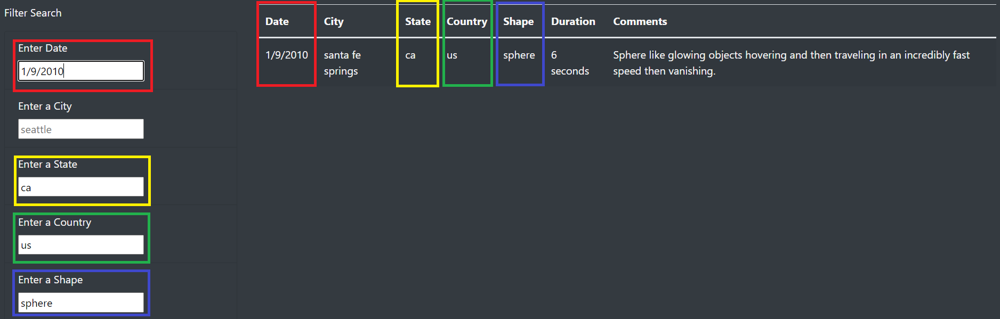
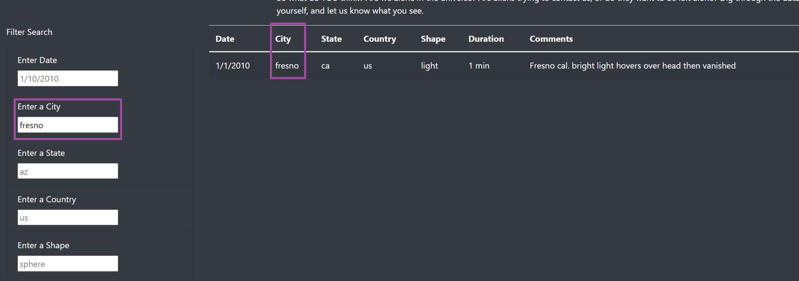

# UFOs
 Module11_JavaScript

# Overview of Project
Dana is a data journalist who wants to present her UFO sighting information in an interactive webpage. Every sigting has the following information: date and time of occurrence, location (city, state, & country) of occurrence, its shape, its duration in minutes, and comments. This data should be presented as a table in individual columns. The data also needs to be filtered based on the user's input wherein the table only shows the data where the filter applies.  

This was done by using JavaScript (takes the data and passes it to the HTML file in an interactive webpage that takes in user's input as filters of the data table) and HTML (displays the data in a webpage).

# Results
Dana can filter the data using the "Filter Search" on the left side of the page where one or all field filters can be applied. For example to get the sphere shaped sightings that occurred in all cities of California, United States on January 9th, 2010 Dana would enter "us" for country, "ca" for state, "1/9/2010" for date and "sphere" for shape. This will give one sighting as seen below.  

Another example is filtering on the city only as seen below.  

# Summary
A drawback of this new design is the lack of a UI button that applies the filters such that the user knows their filter has been taken as an input. Also the filter is case sensitive and requires exact matches. For further development, when no matches are found, a displayed mesage should let that user know as such. Also the addition of a dropdown menu for the filters especially the city such that the user knows all the available options.
